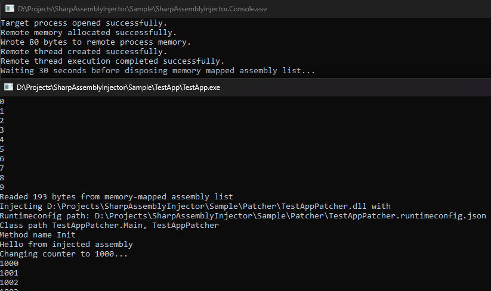

# Project Title

Fully managed injector that inject managed assemblies to managed applications. 

## Usage

 SharpAssemblyInjector.Console {ProcessName} {PathToAssembly} {PathToRuntimeConfig} {ClassPath} {EntryMethod} 
 If you need to inject more than 1 assembly, keep specifying the last 4 parameters for all assemblies to be injected. 

 Example from sample: 
 - SharpAssemblyInjector.Console "TestApp" "Patcher\TestAppPatcher.dll" "Patcher\TestAppPatcher.runtimeconfig.json" "TestAppPatcher.Main, TestAppPatcher" "Init"
   
 Injects TestAppPatcher.dll to TestApp.exe and run TestAppPatcher.Main.Init method.
## Sample
 Check sample in releases. 

## License

[MIT](https://choosealicense.com/licenses/mit/)
